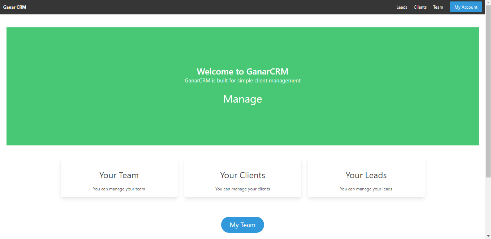
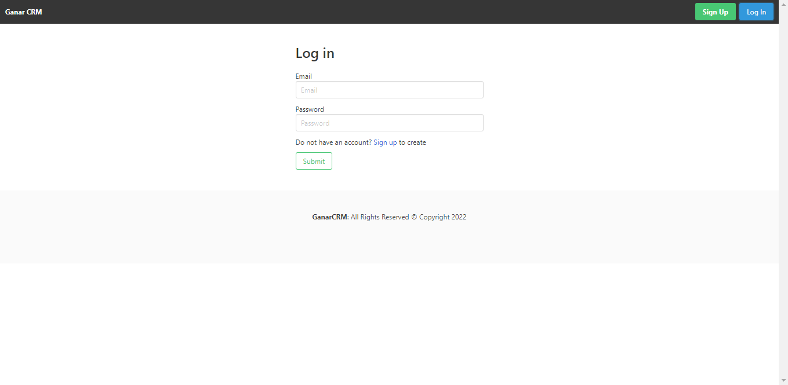
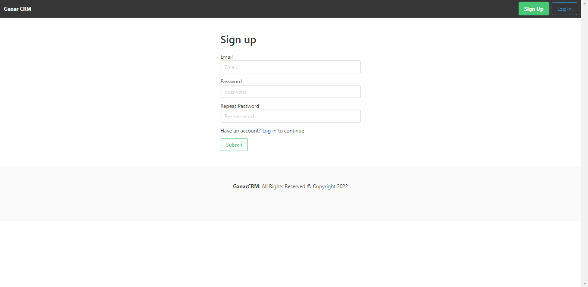
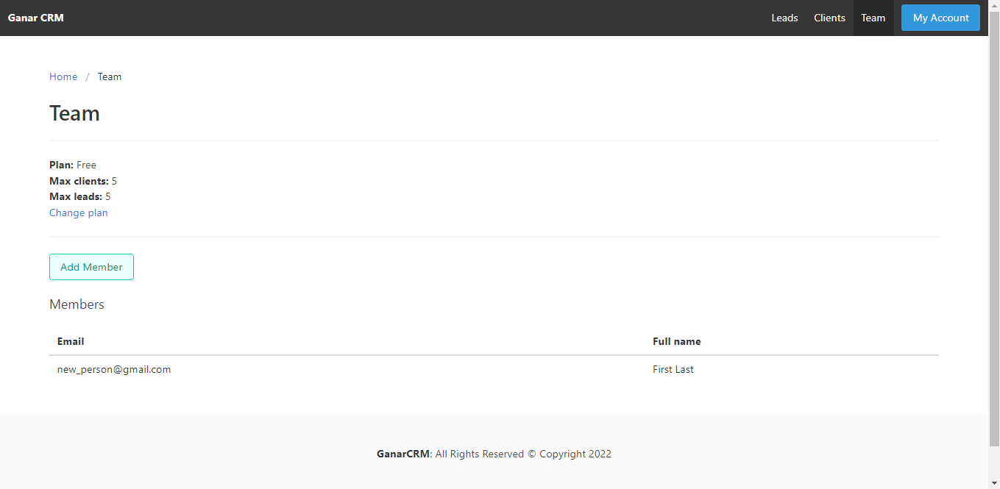
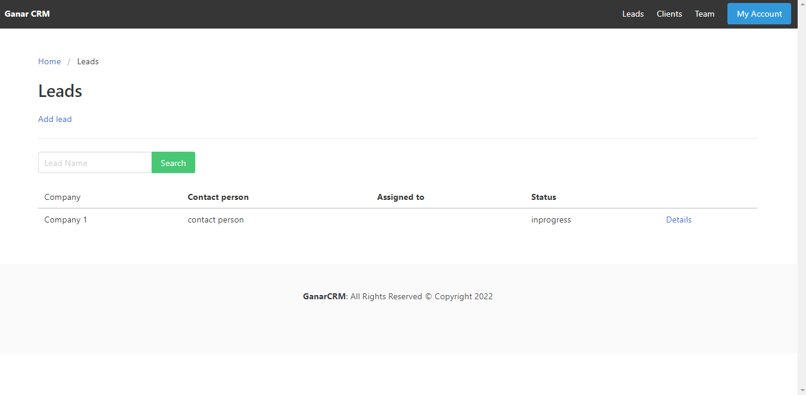
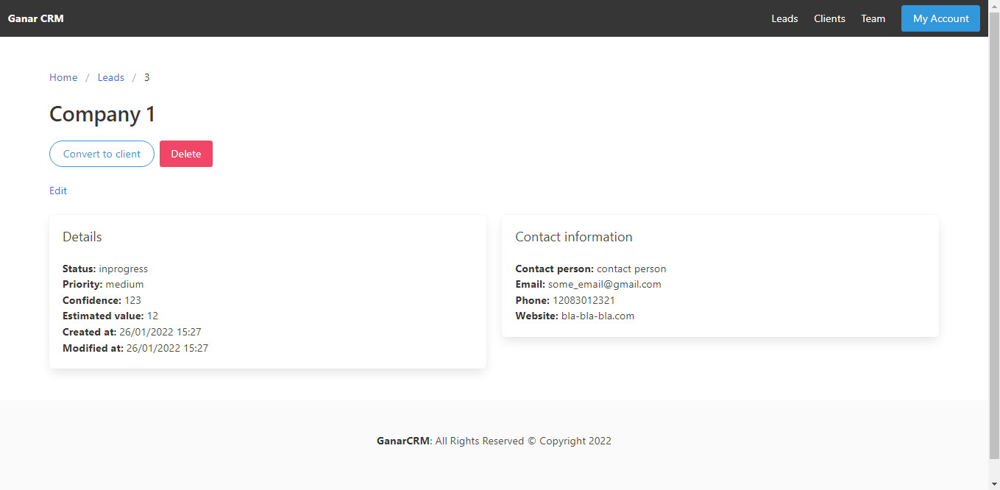
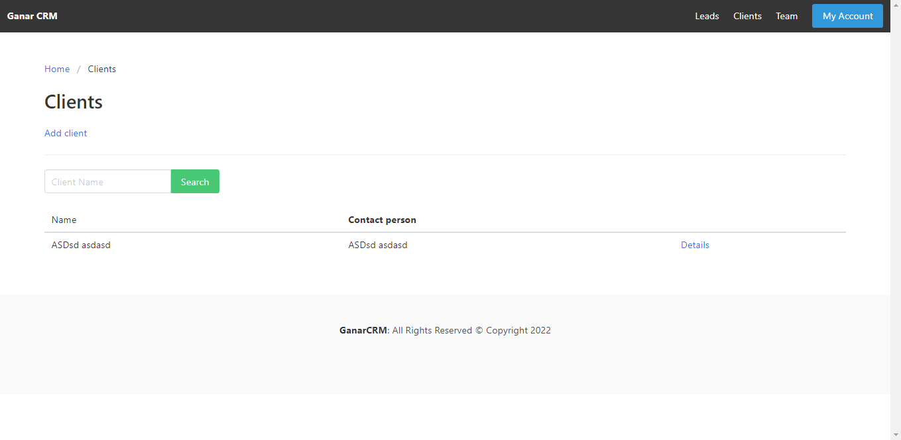
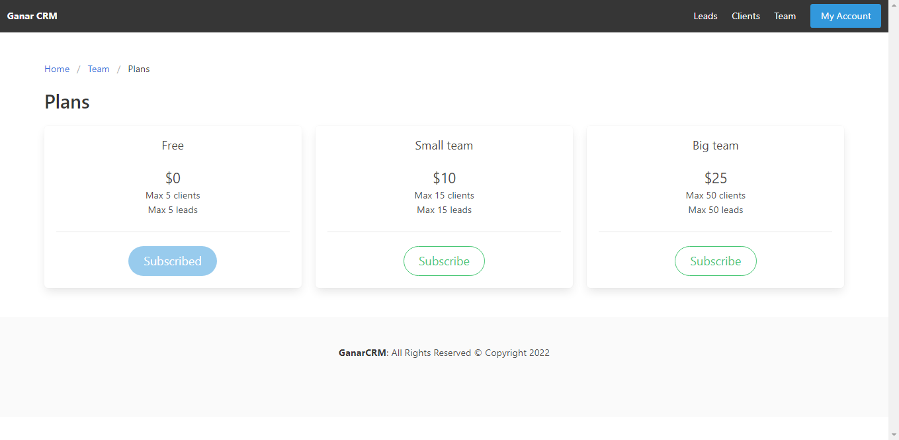

# GanarCRM










### For Vue

```
cd ganarcrm_vue
yarn install
yarn serve
yarn build
```

### For Django

```
cd ganarcrm_django
pip install -r requirements.txt
python manage.py makemigrations
python manage.py migrate
python manage.py createsuperuser
python manage.py runserver
```

### For Stripe

```
Install Stripe
cd stripe_folder
./stripe listen --forward-to 127.0.0.1:8000/api/v1/stripe/webhook/
```
